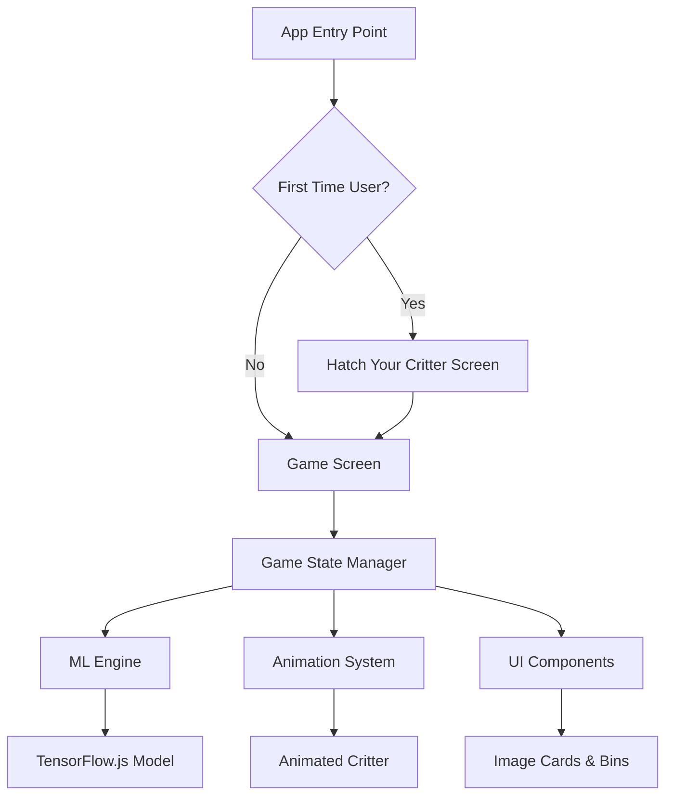
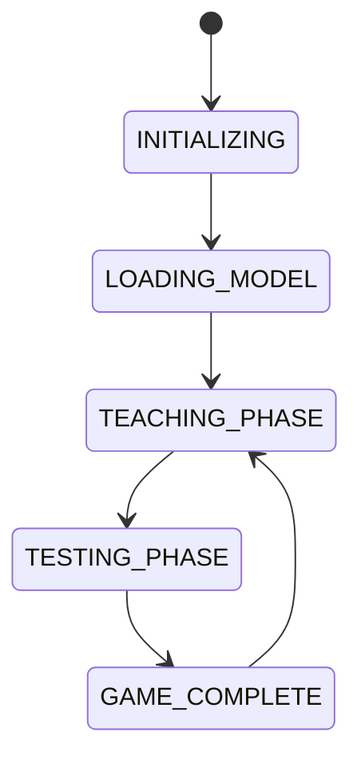

# Design Document: Sorter Machine Gameplay

## Overview

The Sorter Machine Gameplay feature is the core educational mini-game of CogniCritter that teaches children supervised learning through an interactive classification game. The system integrates with the "Hatch Your Critter" personalization feature for first-time users and provides a complete gameplay loop with teaching and testing phases.

The design leverages TensorFlow.js with MobileNetV2 for on-device machine learning, React Native for cross-platform development, and a state-driven architecture to manage the complex gameplay flow while maintaining 60fps performance.

## Architecture

### High-Level System Architecture



### Component Architecture

The system follows a hierarchical component structure with clear separation of concerns:

- **Screen Level**: `HatchingScreen`, `GameScreen` - Handle navigation and top-level state
- **Container Level**: `GameStateManager` - Manages game logic and ML integration
- **Presentation Level**: `AnimatedCritter`, `ImageCard`, `SortingBin` - Handle UI and animations
- **Service Level**: `MLService`, `AnimationService` - Provide core functionality

### State Management Strategy

The application uses a finite state machine approach with `useReducer` for predictable state transitions:



## Components and Interfaces

### Core Components

#### 1. GameScreen Component

**Purpose**: Main game orchestrator that manages the overall game flow and state.

**Props Interface**:

```typescript
interface GameScreenProps {
  route: {
    params: {
      critterColor?: string;
    };
  };
  navigation: NavigationProp;
}
```

**State Interface**:

```typescript
interface GameState {
  phase: 'LOADING' | 'TEACHING' | 'TESTING' | 'COMPLETE';
  currentImageIndex: number;
  trainingData: TrainingExample[];
  testResults: TestResult[];
  score: number;
  critterState: CritterState;
}
```

#### 2. AnimatedCritter Component

**Purpose**: Displays the personalized critter with smooth state transitions and animations.

**Props Interface**:

```typescript
interface AnimatedCritterProps {
  state: 'LOADING' | 'IDLE' | 'THINKING' | 'HAPPY' | 'CONFUSED';
  critterColor: string;
  animationDuration?: number;
}
```

**Animation States**:

- Crossfade transitions between states (250ms duration)
- Color tinting applied to grayscale sprites
- Native driver optimization for 60fps performance

#### 3. ImageCard Component

**Purpose**: Displays images to be classified with drag-and-drop functionality.

**Props Interface**:

```typescript
interface ImageCardProps {
  imageUri: string;
  onSort: (binId: string) => void;
  disabled: boolean;
}
```

#### 4. SortingBin Component

**Purpose**: Target containers for image classification with visual feedback.

**Props Interface**:

```typescript
interface SortingBinProps {
  id: string;
  label: string;
  onDrop: (imageId: string) => void;
  highlighted: boolean;
}
```

### Service Interfaces

#### MLService

```typescript
interface MLService {
  loadModel(): Promise<tf.LayersModel>;
  classifyImage(imageUri: string): Promise<number[]>;
  imageToTensor(imageUri: string): Promise<tf.Tensor>;
}
```

#### AnimationService

```typescript
interface AnimationService {
  createCrossfade(duration: number): Animated.Value;
  createBounce(): Animated.Value;
  createSlide(direction: 'left' | 'right'): Animated.Value;
}
```

## Data Models

### Training Example Model

```typescript
interface TrainingExample {
  id: string;
  imageUri: string;
  userLabel: 'apple' | 'not_apple';
  timestamp: number;
}
```

### Test Result Model

```typescript
interface TestResult {
  id: string;
  imageUri: string;
  trueLabel: 'apple' | 'not_apple';
  predictedLabel: 'apple' | 'not_apple';
  confidence: number;
  isCorrect: boolean;
  predictionTime: number;
}
```

### Game Configuration Model

```typescript
interface GameConfig {
  teachingPhaseImageCount: number; // 5-10 images
  testingPhaseImageCount: number; // 5 images
  targetFrameRate: number; // 60 fps
  maxPredictionTime: number; // 1000ms
  animationDuration: number; // 250ms
}
```

### Image Dataset Model

```typescript
interface ImageDataset {
  apples: ImageItem[];
  notApples: ImageItem[];
}

interface ImageItem {
  id: string;
  uri: string;
  label: 'apple' | 'not_apple';
  metadata?: {
    variety?: string;
    color?: string;
    source?: string;
  };
}
```

## Error Handling

### Model Loading Errors

- **Timeout Handling**: 30-second timeout for model loading with retry mechanism
- **Network Errors**: Graceful fallback with offline model bundling
- **Memory Errors**: Model size optimization and memory cleanup

```typescript
interface ErrorHandler {
  handleModelLoadError(error: Error): void;
  handlePredictionError(error: Error): void;
  handleAnimationError(error: Error): void;
  showUserFriendlyError(message: string): void;
}
```

### Performance Error Handling

- **Frame Rate Monitoring**: Automatic quality reduction if FPS drops below 45
- **Prediction Timeout**: Fallback to random prediction after 1 second
- **Memory Management**: Automatic tensor disposal and garbage collection

### User Experience Error Recovery

- **Invalid Gestures**: Visual feedback for incorrect drag operations
- **App State Changes**: Pause/resume handling for background transitions
- **Device Rotation**: Layout adaptation and state preservation

## Testing Strategy

### Unit Testing

- **Component Testing**: Jest + React Native Testing Library
- **ML Service Testing**: Mock TensorFlow.js predictions
- **Animation Testing**: Snapshot testing for animation states
- **State Management Testing**: Reducer logic validation

### Integration Testing

- **Game Flow Testing**: End-to-end gameplay scenarios
- **ML Pipeline Testing**: Image processing and prediction accuracy
- **Performance Testing**: Frame rate and memory usage monitoring
- **Cross-Platform Testing**: iOS and Android compatibility

### User Acceptance Testing

- **Accessibility Testing**: Screen reader and touch accessibility
- **Age-Appropriate Testing**: 8-12 year old user testing sessions
- **Educational Effectiveness**: Learning outcome measurement
- **Engagement Metrics**: Session duration and completion rates

### Performance Testing Criteria

```typescript
interface PerformanceMetrics {
  frameRate: number; // Target: 60fps, Minimum: 45fps
  modelLoadTime: number; // Target: <5s, Maximum: 10s
  predictionTime: number; // Target: <500ms, Maximum: 1s
  animationSmoothness: number; // Target: 60fps, Minimum: 30fps
  memoryUsage: number; // Target: <100MB, Maximum: 150MB
}
```

### Testing Data Sets

- **Training Images**: 20 apple images, 20 non-apple images
- **Test Images**: 10 apple images, 10 non-apple images
- **Edge Cases**: Unusual angles, lighting conditions, partial objects
- **Bias Testing**: Diverse apple varieties and colors

## Implementation Considerations

### Performance Optimization

- **Native Driver Usage**: All animations use `useNativeDriver: true`
- **Image Optimization**: Automatic resizing to 224x224 for ML processing
- **Tensor Management**: Explicit disposal of tensors to prevent memory leaks
- **Component Memoization**: React.memo for expensive re-renders

### Accessibility Features

- **Screen Reader Support**: Comprehensive aria-labels and hints
- **High Contrast Mode**: Alternative color schemes for visual impairments
- **Touch Target Sizing**: Minimum 44px touch targets for motor accessibility
- **Audio Feedback**: Sound cues for successful and failed classifications

### Internationalization

- **Text Externalization**: All user-facing text in translation files
- **RTL Support**: Layout adaptation for right-to-left languages
- **Cultural Sensitivity**: Culturally appropriate image selections
- **Font Support**: Unicode support for international character sets

### Security and Privacy

- **Local Processing**: All ML processing happens on-device
- **No Data Collection**: No personal data or images sent to external servers
- **Secure Storage**: User preferences stored in encrypted local storage
- **Parental Controls**: Age-appropriate content filtering
