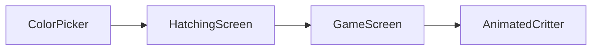

# Hatch Your Critter Feature Implementation

This document provides the complete technical specification and step-by-step implementation guide for the “Hatch Your Critter” personalization feature.

## 1. Feature Overview

The “Hatch Your Critter” feature is the player’s first experience in the game. It allows them to personalize their critter by choosing a color they love. This feature is designed to build an immediate emotional connection between the player and their CogniCritter by letting them create a unique companion that is truly their own.

## 2. Technical Strategy: Color Tinting

To achieve maximum flexibility and efficiency within a hackathon timeline, we will use a color tinting strategy.

**How it Works:** Instead of creating separate sprite assets for every color, we will use a single set of grayscale sprites as a base. In the application, we dynamically colorize these sprites by applying the `tintColor` style property when rendering the image.

**Advantages:**

*   **Efficient:** Requires only one set of art assets, drastically reducing the app's size.
*   **Flexible:** New colors can be added or changed easily, and it's possible to expand to a full color-picker for infinite options.
*   **Simple to Implement:** Requires minimal code changes by leveraging built-in React Native `<Image>` component functionality.

## 3. Art Asset Preparation

This is the critical first step for implementing this feature. All critter sprites must be converted into a tint-ready format.

1.  **Get Original Sprites:** Start with the original, full-color sprites from the `cogni-critter.md` document (IDLE, HAPPY, THINKING, CONFUSED).
2.  **Convert to Grayscale:** In an image editor (like Photoshop or Figma), desaturate (convert to grayscale) each sprite image.
3.  **Adjust Contrast:** This is the most important step. Adjust the Levels or Curves of the image to ensure that:
    *   Areas to be tinted (like the critter's body) are white or light gray.
    *   Areas to remain untinted (like the eyes and outlines) are black or dark gray.
4.  **Export Assets:** Export the new grayscale sprites with a clear naming convention.
    ```
    critter_idle.png -> critter_idle_grayscale.png
    critter_happy.png -> critter_happy_grayscale.png
    ...and so on.
    ```

| Before (Full Color) | After (Tint-Ready Grayscale) |
| ------------------- | ---------------------------- |
|                     |                              |

## 4. Implementation Steps

### Step 1: Create the `ColorPicker.js` Component

Create a reusable component to display the color choices.

```javascript
// src/components/ColorPicker.js
import React from 'react';
import { View, TouchableOpacity, StyleSheet } from 'react-native';

const ColorPicker = ({ selectedColor, onColorSelect }) => {
  // Colors are from our Visual Style Guide
  const colors = ['#A2E85B', '#4D96FF', '#FFD644', '#F037A5', '#FFFFFF']; // Green, Blue, Yellow, Pink, White

  return (
    <View style={styles.container}>
      {colors.map((color) => (
        <TouchableOpacity
          key={color}
          style={[
            styles.colorOption,
            { backgroundColor: color },
            // Add a visual indicator (e.g., a border) for the selected color
            selectedColor === color && styles.selectedOption,
          ]}
          onPress={() => onColorSelect(color)}
        />
      ))}
    </View>
  );
};

const styles = StyleSheet.create({
  container: {
    flexDirection: 'row',
    justifyContent: 'center',
    alignItems: 'center',
    marginVertical: 20,
  },
  colorOption: {
    width: 50,
    height: 50,
    borderRadius: 25,
    marginHorizontal: 10,
    borderWidth: 3,
    borderColor: 'transparent',
  },
  selectedOption: {
    borderColor: '#F5F5F5', // Bright Cloud
  },
});

export default ColorPicker;
```

### Step 2: Create the `HatchingScreen.js` Screen

This new screen will be the first step in the player's journey.

```javascript
// src/screens/HatchingScreen.js
import React, { useState } from 'react';
import { View, Text, TouchableOpacity, StyleSheet } from 'react-native';
import AnimatedCritter from '../components/AnimatedCritter';
import ColorPicker from '../components/ColorPicker';

// The navigation prop will be provided by React Navigation
const HatchingScreen = ({ navigation }) => {
  // Set Cogni Green as the default color
  const [selectedColor, setSelectedColor] = useState('#A2E85B');

  const handleStartGame = () => {
    // Navigate to the main game screen, passing the selected color as a parameter
    navigation.navigate('Game', { critterColor: selectedColor });
  };

  return (
    <View style={styles.container}>
      <Text style={styles.title}>Customize Your Critter!</Text>

      {/* Live preview of the critter */}
      <AnimatedCritter state="IDLE" critterColor={selectedColor} />

      <Text style={styles.subtitle}>Choose a color</Text>
      <ColorPicker
        selectedColor={selectedColor}
        onColorSelect={setSelectedColor}
      />

      <TouchableOpacity style={styles.button} onPress={handleStartGame}>
        <Text style={styles.buttonText}>Start Game!</Text>
      </TouchableOpacity>
    </View>
  );
};

// Styles using our Visual Style Guide
const styles = StyleSheet.create({
    container: {
        flex: 1,
        backgroundColor: '#0B132B', // Deep Space Navy
        alignItems: 'center',
        justifyContent: 'center',
        padding: 20,
    },
    title: {
        fontFamily: 'Nunito-ExtraBold',
        fontSize: 32,
        color: '#F5F5F5',
        marginBottom: 20,
    },
    subtitle: {
        fontFamily: 'Poppins-Regular',
        fontSize: 18,
        color: '#F5F5F5',
        marginTop: 20,
    },
    button: {
        backgroundColor: '#F037A5', // Action Pink
        paddingHorizontal: 30,
        paddingVertical: 15,
        borderRadius: 25,
        marginTop: 30,
    },
    buttonText: {
        fontFamily: 'Nunito-ExtraBold',
        fontSize: 20,
        color: '#FFFFFF',
    },
});

export default HatchingScreen;
```

### Step 3: Modify `GameScreen.js` and `AnimatedCritter.js`

Finally, pass the selected color into the game.

**In `GameScreen.js`:** Receive the color from the navigation parameters.

```javascript
// src/screens/GameScreen.js
const GameScreen = ({ route }) => {
  // Receive the color from the HatchingScreen
  const { critterColor } = route.params;

  // ... your game logic ...

  return (
    <View>
      {/* Pass the color to the critter */}
      <AnimatedCritter state={currentGameState} critterColor={critterColor} />
      {/* ... rest of your game ... */}
    </View>
  );
};
```

**In `AnimatedCritter.js`:** Apply the `tintColor`.

```javascript
// src/components/AnimatedCritter.js
import { Animated, StyleSheet } from 'react-native';

const AnimatedCritter = ({ state, critterColor }) => {
  // ... all your existing animation logic ...

  // Make sure to use the grayscale assets
  const spriteAssets = {
    IDLE: require('../assets/critter_idle_grayscale.png'),
    // ... other states
  };

  return (
    <View style={styles.container}>
      <Animated.Image
        source={spriteAssets[state]}
        // The color is applied here!
        style={[styles.sprite, { tintColor: critterColor }]}
      />
      {/* ... your logic for crossfading the previous sprite also needs the tintColor ... */}
    </View>
  );
};
```

## 5. Data Flow


